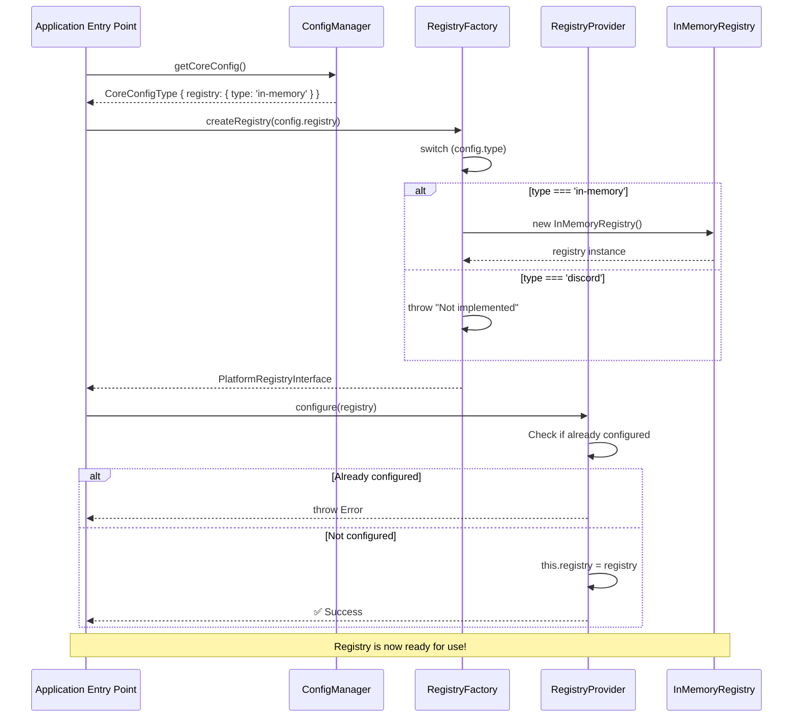
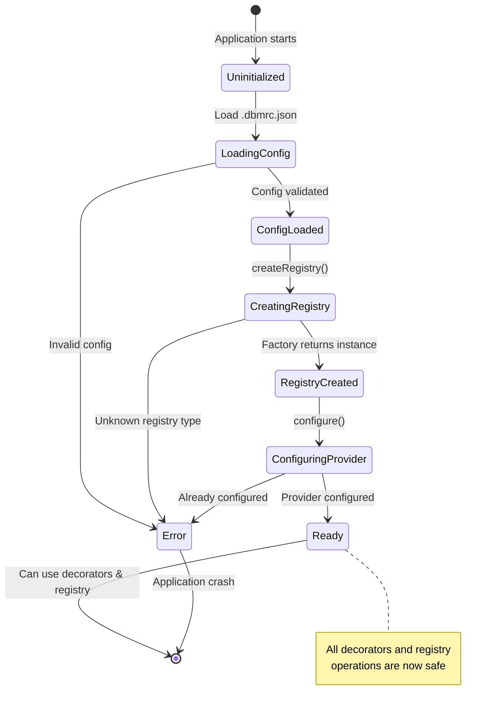
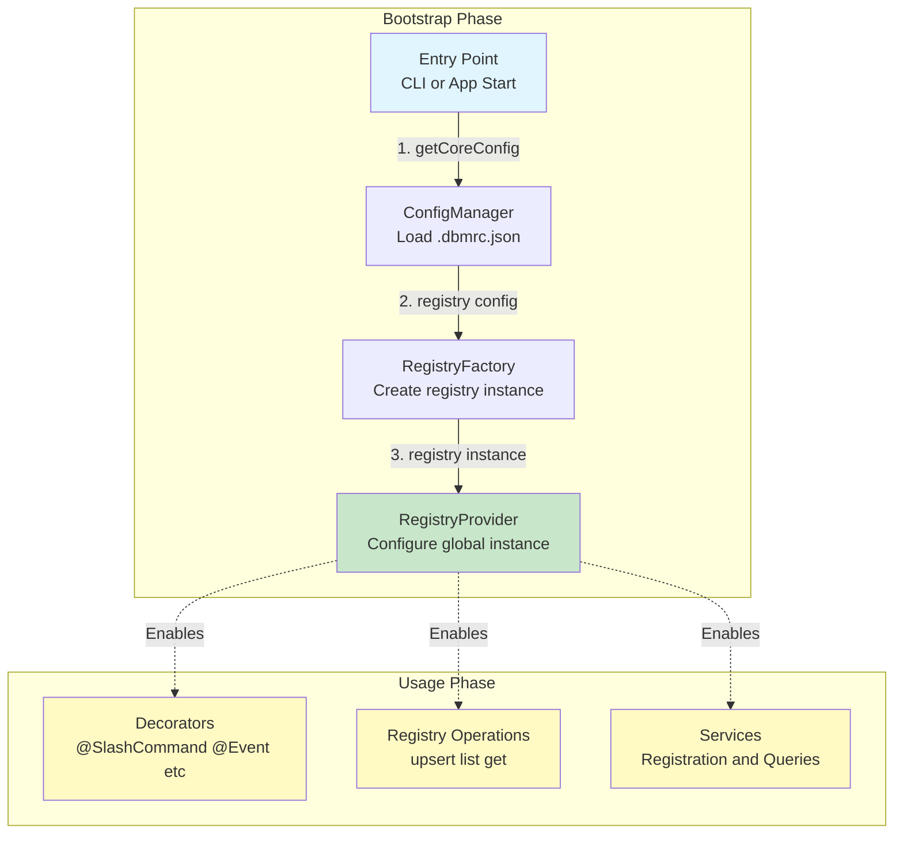

# System Initialization Workflow

## Overview

This diagram shows how the core library must be initialized before any registry operations can occur.

## Initialization Flow



## State Diagram



## Component Interaction



## Critical Notes

⚠️ **IMPORTANT**:

- `registryProvider.configure()` MUST be called before any decorator executes
- Configuration can only happen once (unless `reset()` is called)
- All decorators will throw if provider not configured
- This initialization must happen at application bootstrap

## Example Implementation

```typescript
// bootstrap.ts
import { config } from "@gildraen/dbm-core";
import {
  createRegistry,
  registryProvider,
} from "@gildraen/dbm-core/infrastructure";

export function initializeCore() {
  // 1. Get core configuration
  const coreConfig = config.getCoreConfig();

  // 2. Create registry based on config type
  const registry = createRegistry(coreConfig.registry);

  // 3. Configure the global provider
  registryProvider.configure(registry);

  console.log("✅ Core initialized and ready");
}

// main.ts
import { initializeCore } from "./bootstrap.js";

// CRITICAL: Initialize before importing any decorated modules
initializeCore();

// Now safe to import modules with decorators
import "./modules/my-module/index.js";
```
