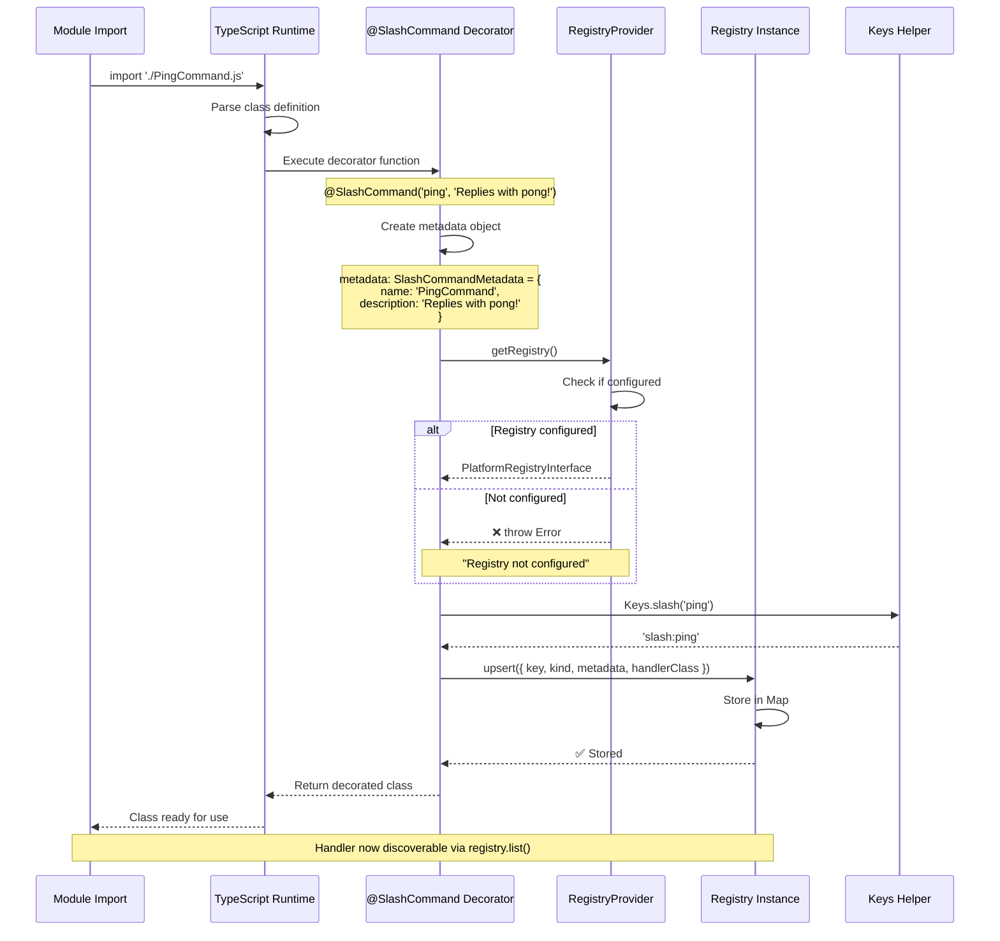
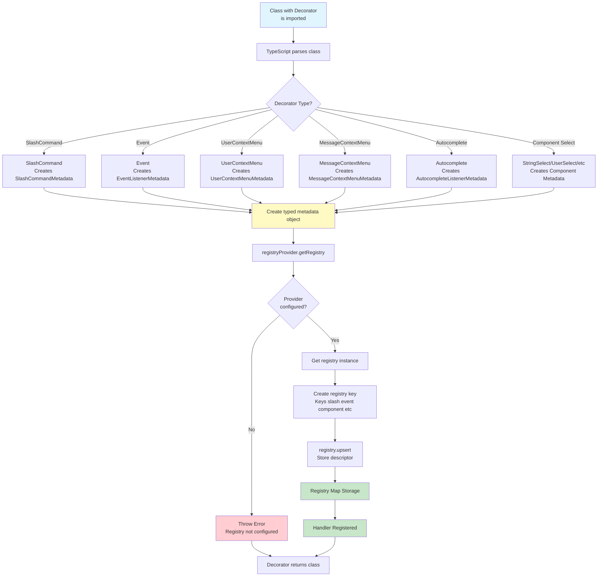
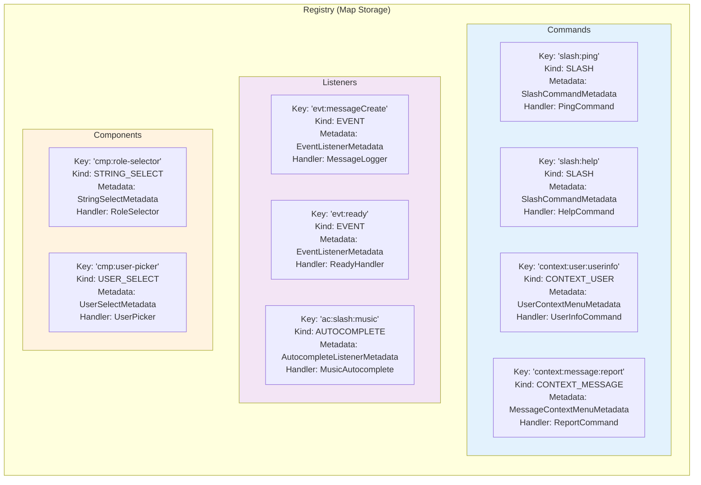
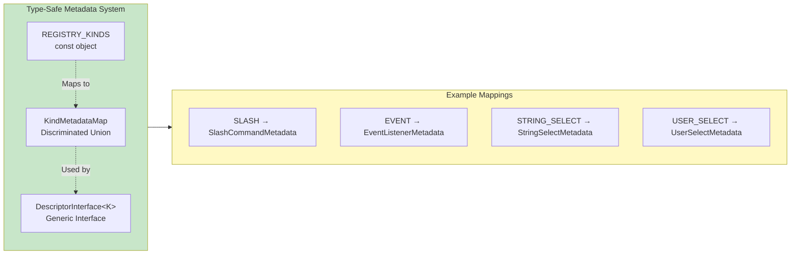
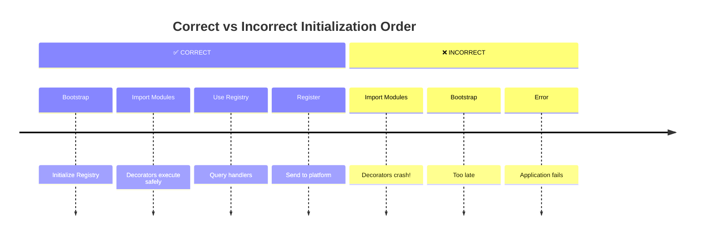

# Decorator Registration Workflow

## Overview

This diagram shows how decorators register handlers in the registry when TypeScript classes are imported.

## Decorator Execution Flow



## All Decorator Types Flow



## Registry Storage Structure



## Metadata Type Safety



## Critical Points

### ⚠️ Timing is Critical



### 🔑 Key Concepts

1. **Decorators execute at import time** - Not when class is instantiated
2. **Registry must be configured first** - Before any decorated class imports
3. **Metadata is type-safe** - TypeScript validates at compile time
4. **Keys are unique** - Each handler has a unique registry key
5. **Upsert behavior** - Same key replaces previous registration

### 📝 Example Decorator Usage

```typescript
// PingCommand.ts
import { SlashCommand } from "@gildraen/dbm-core";

type PingInteraction = {
  reply(content: string): Promise<unknown>;
};

@SlashCommand("ping", "Replies with pong!")
export class PingCommand {
  name = "PingCommand";

  async handle(interaction: PingInteraction): Promise<void> {
    await interaction.reply("Pong!");
  }

  buildCommand() {
    return {
      type: "slash" as const,
      name: "ping",
      description: "Replies with pong!",
    };
  }
}
```

When this file is imported, the decorator:

1. ✅ Creates metadata: `{ name: 'ping', description: 'Replies with pong!' }`
2. ✅ Gets registry from provider
3. ✅ Creates key: `'slash:ping'`
4. ✅ Stores descriptor with metadata and class reference
5. ✅ Returns the decorated class
