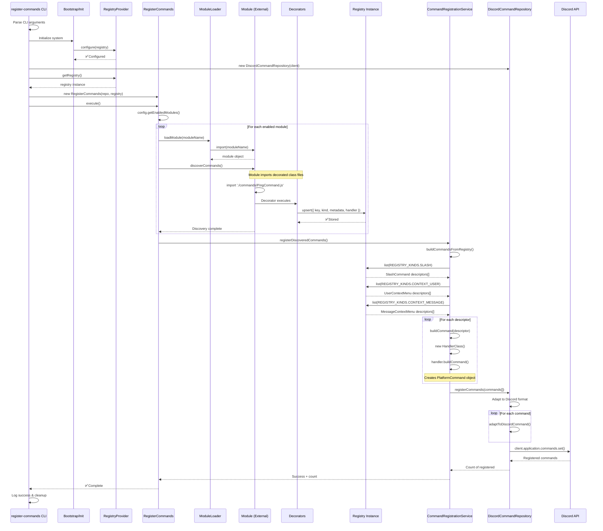
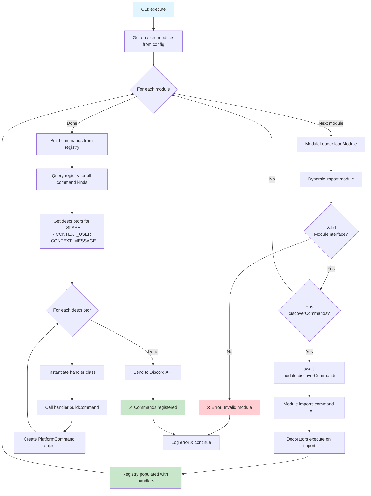
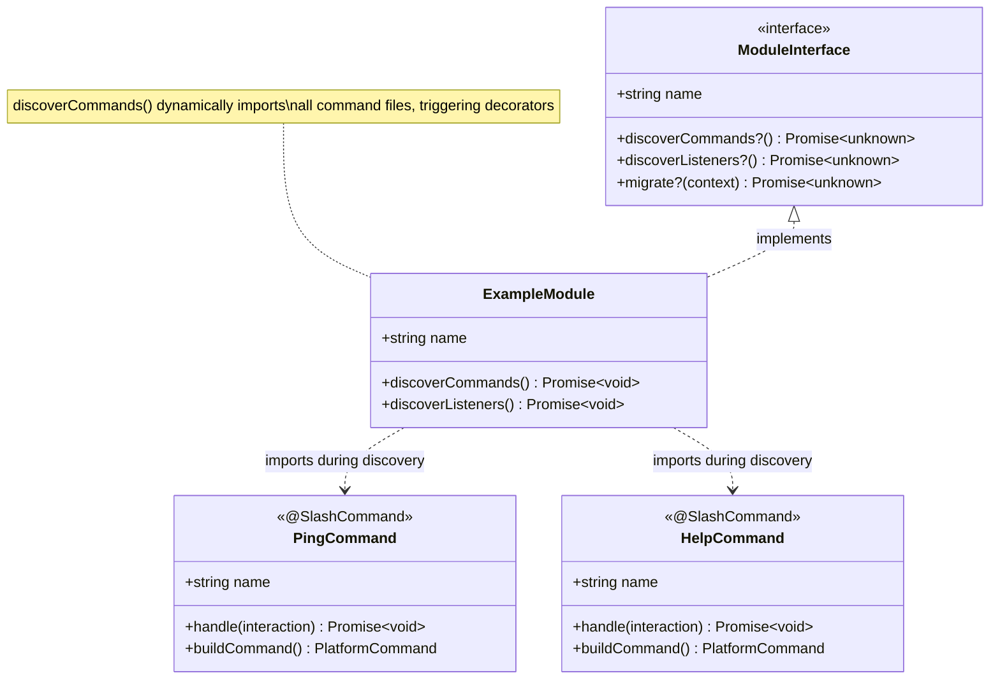
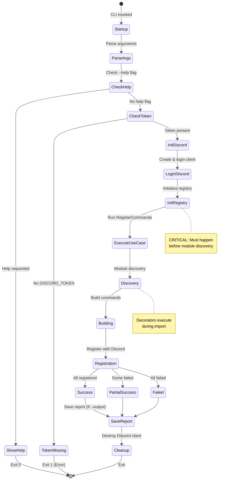
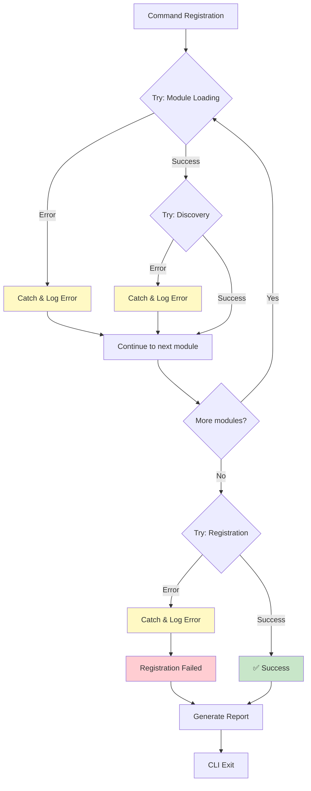

# Command Registration Workflow (CLI)

## Overview

This diagram shows the complete flow from CLI execution to Discord API command registration.

## Full Command Registration Flow



## Command Discovery Phase (Detailed)



## Module Discovery Contract



## Command Building Process

```mermaid
flowchart LR
    subgraph Registry["Registry State"]
        Desc1[Descriptor 1<br/>SlashCommand]
        Desc2[Descriptor 2<br/>UserContextMenu]
        Desc3[Descriptor 3<br/>MessageContextMenu]
    end

    subgraph Service["CommandRegistrationService"]
        direction TB
        List[List all command kinds]
        Build[Build each command]
        Collect[Collect PlatformCommands]
    end

    subgraph Transform["Handler → Platform"]
        direction TB
        Inst[Instantiate Handler]
        Call[Call buildCommand]
        Platform[PlatformCommand object]
    end

    subgraph Repository["DiscordCommandRepository"]
        direction TB
        Adapt[Adapt to Discord format]
        Send[Send to Discord API]
        Result[Return count]
    end

    Registry --> List
    List --> Build
    Build --> Transform
    Transform --> Collect
    Collect --> Adapt
    Adapt --> Send
    Send --> Result

    style Registry fill:#e3f2fd
    style Transform fill:#fff9c4
    style Result fill:#c8e6c9
```



## PlatformCommand Structure

```mermaid
graph TB
    subgraph Platform["PlatformCommand Types"]
        direction TB

        Base[PlatformCommand<br/>Union Type]

        Slash["PlatformSlashCommand<br/>type: \"slash\"<br/>name: string<br/>description: string<br/>options: CommandOption array"]

        UserCtx["PlatformUserContextCommand<br/>type: \"context:user\"<br/>name: string"]

        MsgCtx["PlatformMessageContextCommand<br/>type: \"context:message\"<br/>name: string"]

        Base --> Slash
        Base --> UserCtx
        Base --> MsgCtx
    end

    subgraph Discord["Discord API Format"]
        direction TB

        DiscordCmd[RESTPostAPIApplicationCommandsJSONBody]

        DiscordSlash["type: 1 ChatInput<br/>name: string<br/>description: string<br/>options: array"]

        DiscordUserCtx["type: 2 User<br/>name: string"]

        DiscordMsgCtx["type: 3 Message<br/>name: string"]

        DiscordCmd --> DiscordSlash
        DiscordCmd --> DiscordUserCtx
        DiscordCmd --> DiscordMsgCtx
    end

    Slash -.->|Adapt| DiscordSlash
    UserCtx -.->|Adapt| DiscordUserCtx
    MsgCtx -.->|Adapt| DiscordMsgCtx

    style Platform fill:#e3f2fd
    style Discord fill:#c8e6c9
```

## CLI Lifecycle



## Error Handling



## Key Points

### 🎯 Critical Success Factors

1. ✅ **Registry initialized before module discovery**
2. ✅ **Modules implement `discoverCommands()` correctly**
3. ✅ **Decorators execute during imports**
4. ✅ **All handlers implement `buildCommand()`**
5. ✅ **Discord client authenticated**

### ⚠️ Common Failure Points

1. ❌ Registry not configured → Decorator crashes
2. ❌ Module doesn't import command files → Nothing registered
3. ❌ Handler missing `buildCommand()` → Build phase fails
4. ❌ Invalid Discord token → API call fails
5. ❌ Invalid command structure → Discord API rejects

### 📊 Success Metrics

- **Discovery**: Number of modules processed
- **Registry**: Number of handlers registered
- **Building**: Number of platform commands built
- **Registration**: Number of commands registered with Discord
- **Comparison**: Built vs Registered (should match)
