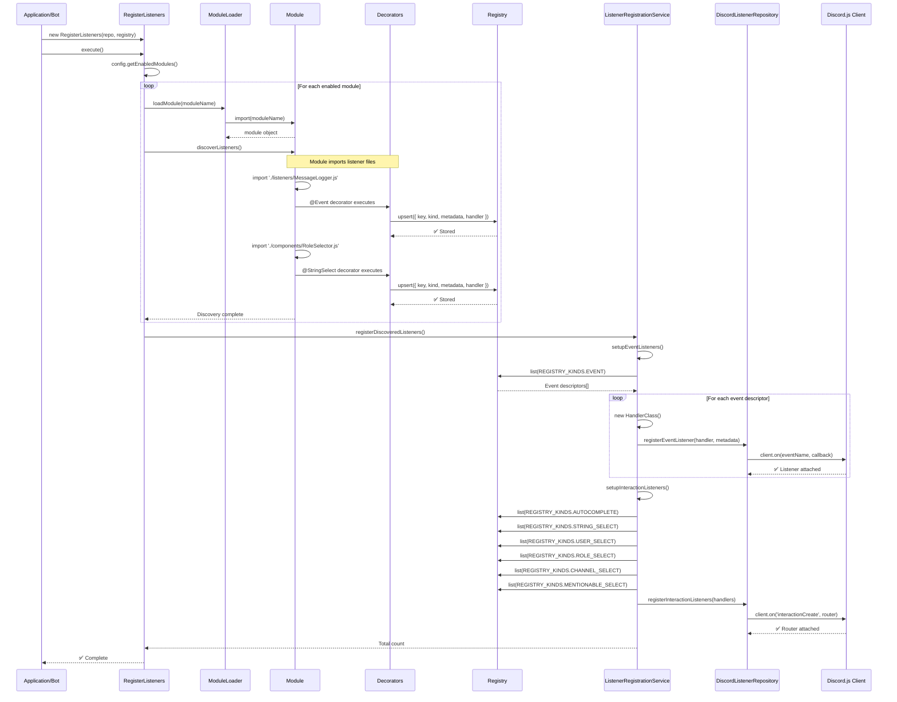
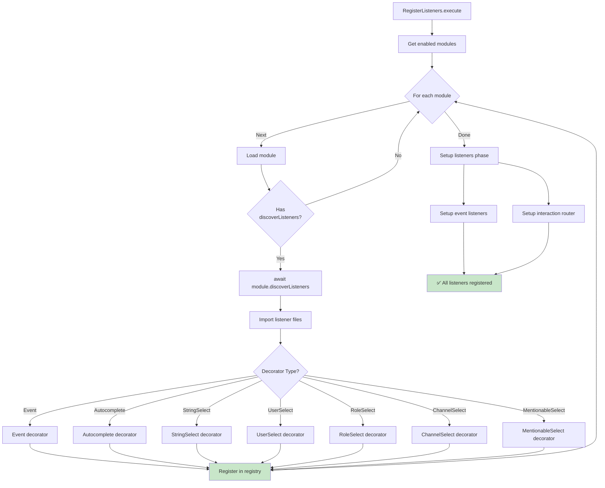
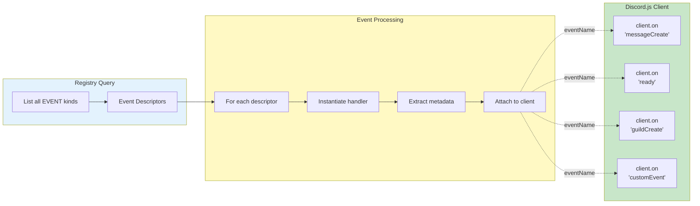
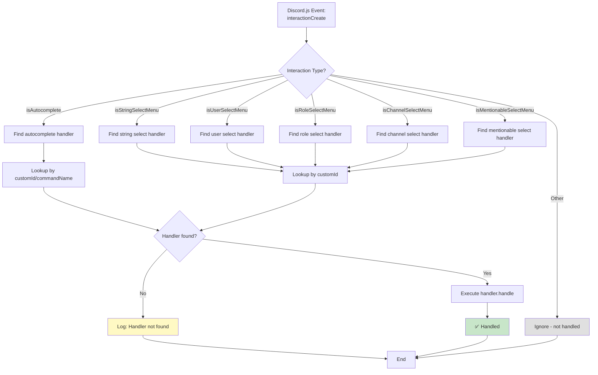
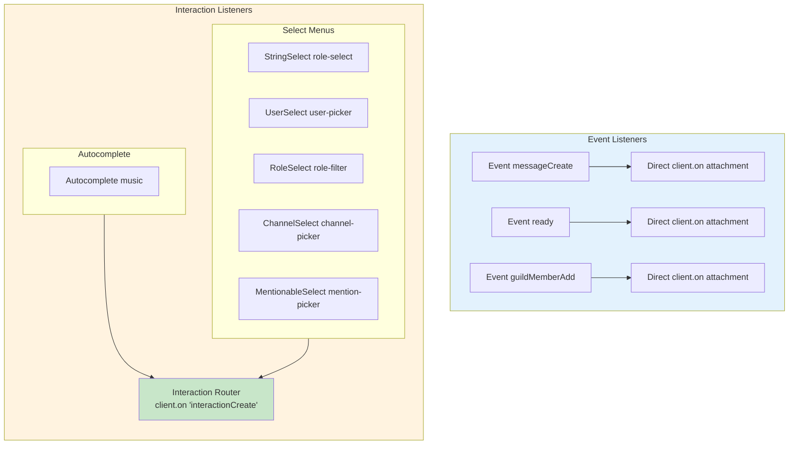
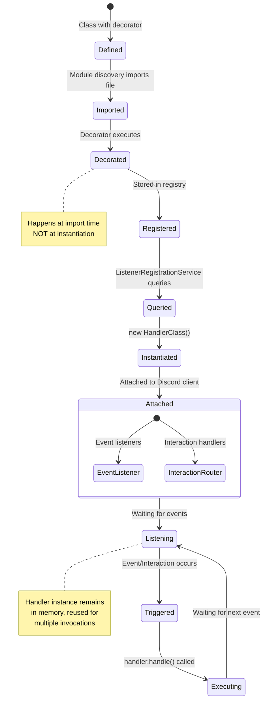
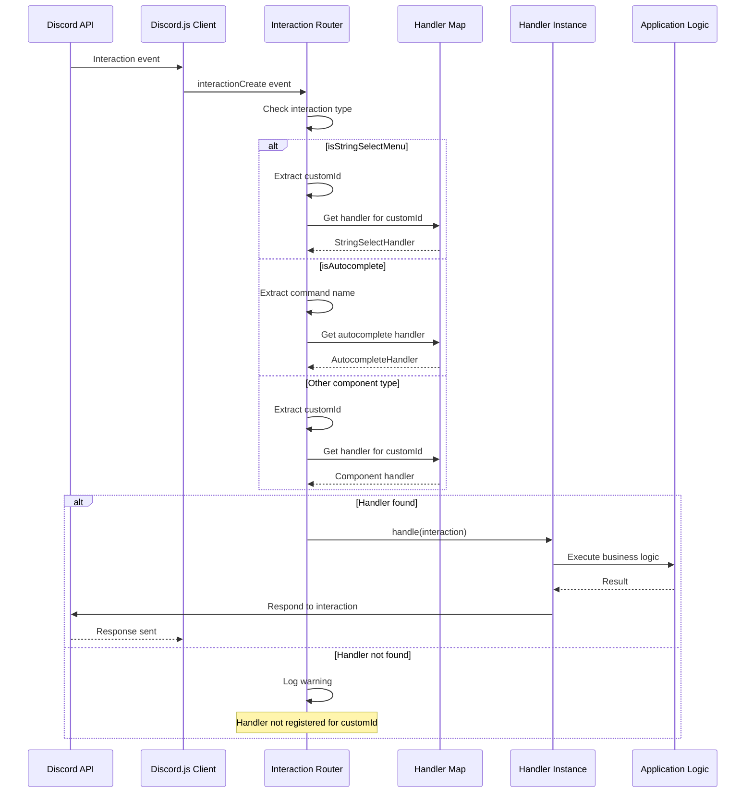
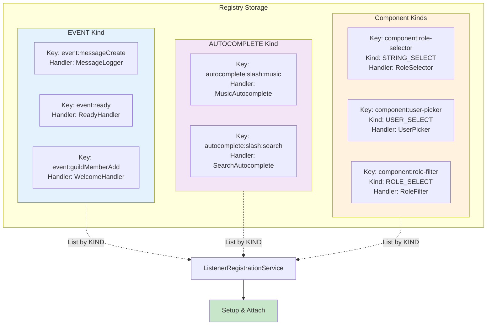
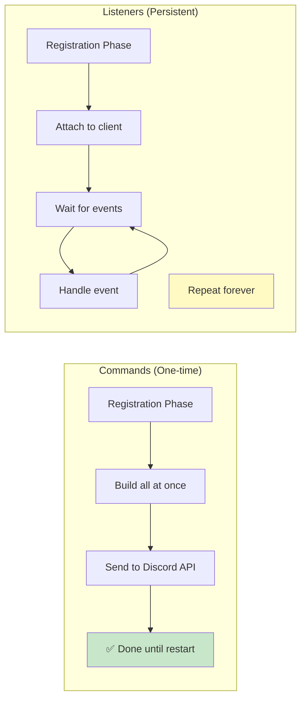
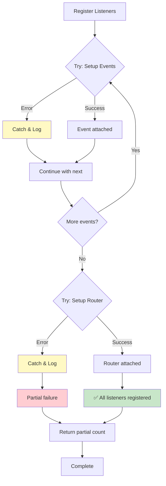

# Listener Registration Workflow

## Overview

This diagram shows how event listeners and interaction handlers are discovered and registered with Discord.js client.

## Full Listener Registration Flow

## Listener Discovery Phase

## Event Listener Setup

## Interaction Listener Router

## Listener Types & Registration

## Handler Lifecycle

## Component Handler Routing

## Registry Organization for Listeners

## Key Differences: Commands vs Listeners

## Error Handling in Listener Registration

## Critical Notes

### 🎯 Key Concepts

1. **Event Listeners**: Direct attachment to Discord.js client events
2. **Interaction Router**: Single handler that routes component interactions
3. **Handler Instances**: Created once, reused for all invocations
4. **Custom ID Mapping**: Components identified by their customId
5. **Type Safety**: Each interaction type has specific handler interface

### ⚠️ Common Issues

1. ❌ CustomId mismatch → Handler not found
2. ❌ Missing `discoverListeners()` → Handlers not imported
3. ❌ Handler not instantiated → Can't call handle method
4. ❌ Wrong interaction type → Router can't match
5. ❌ Event name typo → Listener never triggered

### 📊 Success Indicators

- **Discovery**: All listener files imported
- **Registry**: All handlers stored with correct kinds
- **Attachment**: All event listeners attached to client
- **Router**: Interaction router attached and functioning
- **Execution**: Handlers responding to events/interactions
