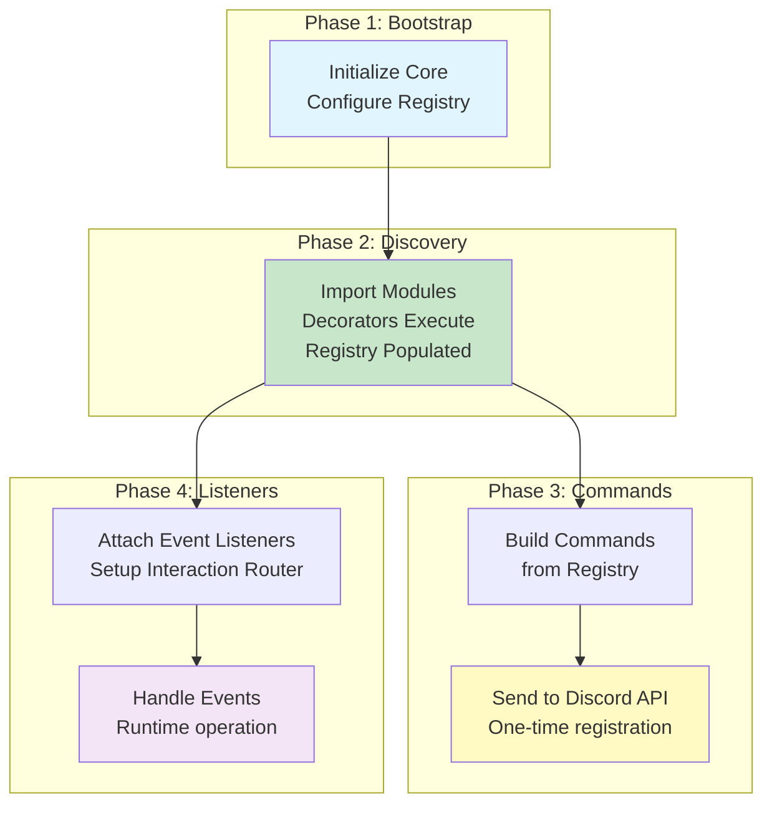

# Discord Bot Core - Workflow Documentation

## Overview

This directory contains comprehensive Mermaid diagrams documenting all major workflows in the Discord Bot Core library.

## Available Workflows

### 1. [System Initialization](./01-system-initialization.md)

**Critical** - Must understand before using the library

Covers:

- How to properly initialize the core library
- Registry configuration and bootstrap process
- State management and lifecycle
- Component interaction during startup

**Key Takeaway**: Registry must be configured before any decorator executes!

---

### 2. [Decorator Registration](./02-decorator-registration.md)

**Core Concept** - How handlers get registered

Covers:

- Decorator execution timing (import time!)
- How decorators populate the registry
- Type-safe metadata creation
- Registry storage structure

**Key Takeaway**: Decorators execute when classes are imported, not instantiated!

---

### 3. [Command Registration](./03-command-registration.md)

**CLI Workflow** - Complete flow from CLI to Discord API

Covers:

- `register-commands` CLI execution
- Module discovery process
- Command building from registry
- Discord API integration
- Error handling

**Key Takeaway**: Commands are built once and sent to Discord as a batch!

---

### 4. [Listener Registration](./04-listener-registration.md)

**Runtime Workflow** - How event and interaction handlers work

Covers:

- Event listener attachment
- Interaction router pattern
- Component handler routing
- Handler lifecycle
- Differences from command registration

**Key Takeaway**: Listeners are persistent and handle events throughout bot lifetime!

---

## Quick Start Guide

### Recommended Reading Order

1. **Start here**: [System Initialization](./01-system-initialization.md)
   - Understand the bootstrap requirement
   - Learn proper setup sequence

2. **Then read**: [Decorator Registration](./02-decorator-registration.md)
   - Understand how decorators work
   - Learn about registry population

3. **For CLI usage**: [Command Registration](./03-command-registration.md)
   - Complete command registration flow
   - Module discovery pattern

4. **For runtime**: [Listener Registration](./04-listener-registration.md)
   - Event and interaction handling
   - Handler lifecycle

---

## Visual Summary



---

## Common Patterns

### Module Structure

```typescript
// Module index.ts
export const name = "@my-scope/my-module";

export async function discoverCommands() {
  // Import command files - decorators execute on import
  await import("./commands/PingCommand.js");
  await import("./commands/HelpCommand.js");
}

export async function discoverListeners() {
  // Import listener files - decorators execute on import
  await import("./listeners/MessageLogger.js");
  await import("./components/RoleSelector.js");
}
```

### Handler Implementation

```typescript
// Command handler
import { SlashCommand } from "@gildraen/dbm-core";
import type { SlashCommandHandler } from "@gildraen/dbm-core";

@SlashCommand("ping", "Replies with pong!")
export class PingCommand implements SlashCommandHandler {
  name = "PingCommand";

  async handle(interaction: CommandInteraction) {
    await interaction.reply("Pong!");
  }

  buildCommand() {
    return {
      type: "SLASH" as const,
      name: "ping",
      description: "Replies with pong!",
    };
  }
}
```

```typescript
// Event listener
import { Event } from "@gildraen/dbm-core";
import type { EventHandler } from "@gildraen/dbm-core";

@Event("messageCreate")
export class MessageLogger implements EventHandler {
  name = "MessageLogger";

  async handle(client: Client, message: Message) {
    console.log(`Message from ${message.author.tag}: ${message.content}`);
  }
}
```

---

## Critical Points Recap

### ⚠️ Must Do Before Using

1. ✅ Configure registry with `registryProvider.configure()`
2. ✅ Ensure configuration loaded from `.dbmrc.json`
3. ✅ Initialize BEFORE importing any decorated modules

### 🎯 Understanding Decorators

1. ✅ Decorators execute at **import time**, not instantiation
2. ✅ Each decorator registers handler in the registry
3. ✅ Registry must be configured before decorator execution
4. ✅ Metadata is type-safe via TypeScript generics

### 🔄 Workflow Differences

**Commands** (One-time):

- Built from registry
- Sent to Discord API as batch
- Static until next registration

**Listeners** (Persistent):

- Attached to Discord.js client
- Run continuously during bot lifetime
- Handle events as they occur

---

## Troubleshooting

### "Registry not configured" Error

**Cause**: Tried to use `registryProvider.getRegistry()` before calling `configure()`

**Solution**: Initialize registry during bootstrap:

```typescript
import { config, createRegistry, registryProvider } from "@gildraen/dbm-core";

const coreConfig = config.getCoreConfig();
const registry = createRegistry(coreConfig.registry);
registryProvider.configure(registry);
```

### Decorator Doesn't Register Handler

**Cause**: Class file not imported during discovery

**Solution**: Ensure `discoverCommands()`/`discoverListeners()` imports the file:

```typescript
export async function discoverCommands() {
  await import("./commands/MyCommand.js"); // This triggers decorator
}
```

### Handler Not Found at Runtime

**Cause**: CustomId or event name mismatch

**Solution**: Verify decorator parameter matches what Discord sends:

```typescript
@StringSelect('role-selector') // Must match customId in component
@Event('messageCreate')        // Must match Discord.js event name
```

---

## Additional Resources

- [Architecture Decision Record](../WORKFLOW_ANALYSIS.md)
- [Configuration Schema](../../src/domain/config/ConfigSchema.ts)
- [Registry Interfaces](../../src/domain/interface/registry/)
- [Decorator Implementations](../../src/domain/decorators/)

---

## Viewing Mermaid Diagrams

These diagrams use Mermaid syntax and can be viewed in:

- ✅ **GitHub** - Renders Mermaid natively
- ✅ **VS Code** - Install "Markdown Preview Mermaid Support" extension
- ✅ **JetBrains IDEs** - Built-in Mermaid support
- ✅ **Online** - [Mermaid Live Editor](https://mermaid.live/)

---

## Contributing

When updating workflows:

1. Keep diagrams up-to-date with code changes
2. Use consistent styling and colors
3. Include both sequence and flowchart views where appropriate
4. Add explanatory notes for complex interactions
5. Update this README if adding new workflow documents
